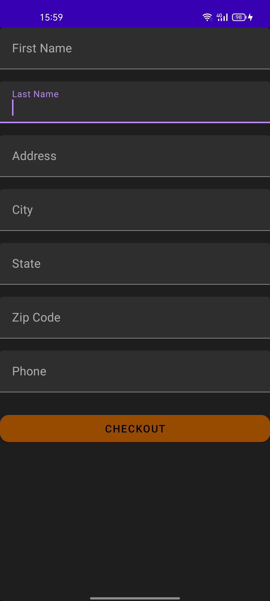

# coffee ordering

Coffee ordering is an Android application built using kotlin to assist users to order and select various types of coffee. I used this project to help me in learning concepts in Android.

## ScreenShots(Dark Mode)





## Libraries and technologies used


```

Kotlin
ViewModel
Firebase:Used it for user Authentication


